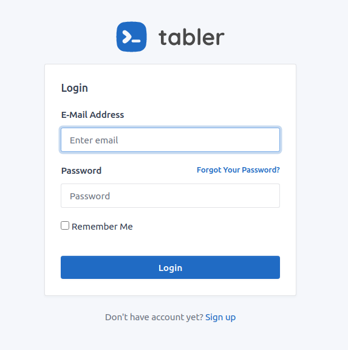

# LARAVEL TABLER

[](https://scrutinizer-ci.com/g/codegoen/lava-tabler/?branch=master)
[](https://packagist.org/packages/rizkhal/:package_name)
[](https://github.styleci.io/repos/268721029)
[](https://scrutinizer-ci.com/g/codegoen/lava-tabler/build-status/master)
[](https://packagist.org/packages/rizkhal/:package_name)



This is a simple package to speed up the development process using templates from [Tabler](https://tabler.io/ )

## Installation

You can install the package via composer:

```bash
composer require rizkhal/lara-tabler
```

### Usage

You can use commands

```bash
php artisan tabler:make-auth
```

After that you can install and build your assets

```bash
npm install && npm run dev
```

After that you can make a controller with

```bash
php artisan ui:controllers
```

Make sure you have installed `laravel/ui`

Configure your route and try it with access auth page

## Todo
- [ ] Add components for basic CRUD
- [ ] Add datatables from Yajra

### Testing

``` bash
composer test
```
