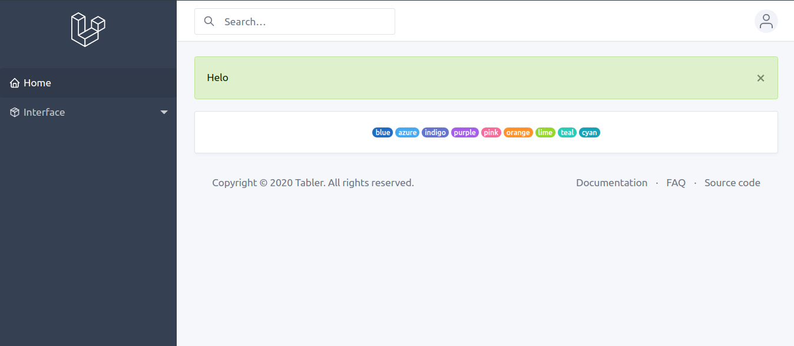

# LARAVEL TABLER

[](https://scrutinizer-ci.com/g/codegoen/lava-tabler/?branch=master)
[](https://packagist.org/packages/rizkhal/lara-tabler)
[](https://github.styleci.io/repos/268721029)
[](https://scrutinizer-ci.com/g/codegoen/lava-tabler/build-status/master)
[](https://packagist.org/packages/rizkhal/lara-tabler)



This is a simple package to speed up the development process using templates from [Tabler](https://tabler.io)

## Installation

You can install the package via composer:

```bash
composer require rizkhal/lara-tabler
```

### Authentication

You can use commands

```bash
php artisan tabler:auth
```

Install and build your assets

```bash
npm install && npm run dev
```

Here you don't use `@extends` but use `<x-app-layout></x-app-layout>` instead
and parsing your page title in `title` tag.

```blade
<x-app-layout title="Page title is here...">
    @section('content')
        <!-- content is here... -->
    @stop
</x-app-layout>
```

Inside the auth page, you use `<x-auth-layout title="Page title is here..."></x-auth-layout>`

### Components

Use commands

```bash
php artisan tabler:components
```

For create all support components or create a component using flag `--component=[component-name]`

Now available two component
- alert
- badge

### Component usage

1. Alert component 

If you want to make the alert dismissable, you just add `dismiss="true"` in `<x-alert>` tag
```blade
<x-alert type="success">
    This is your alert message
</x-alert>
```

2. Badge

If you want to make the badge pill, you just add ` type="badge-pill"` in `<x-badge>` tag
```blade
<x-badge color="purple">
    badge
</x-badge>
```

Read the docs for custom your component [Documentation](https://preview.tabler.io/docs/index.html)

### Todo
- [x] Add support component
- [ ] Add CRUD
- [ ] Add datatables

### Testing

``` bash
composer test
```
