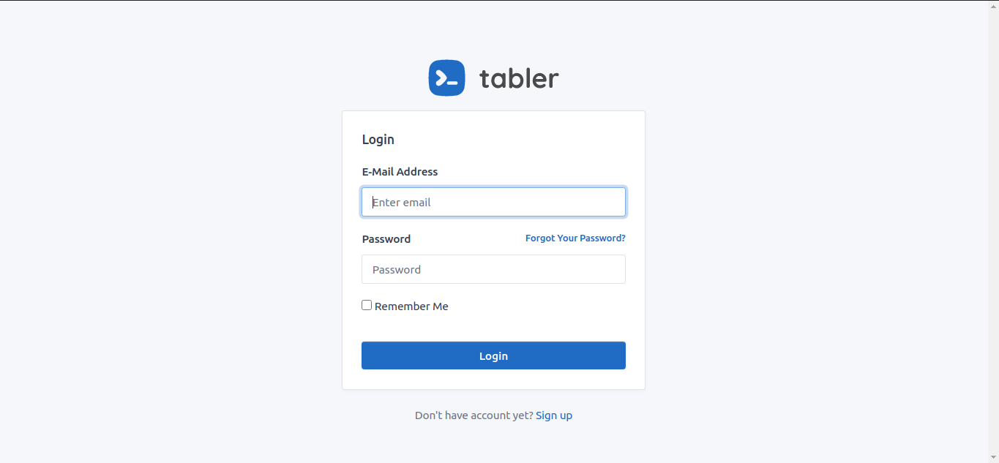

# LARAVEL TABLER

[](https://scrutinizer-ci.com/g/codegoen/lava-tabler/?branch=master)
[](https://packagist.org/packages/rizkhal/lara-tabler)
[](https://github.styleci.io/repos/268721029)
[](https://scrutinizer-ci.com/g/codegoen/lava-tabler/build-status/master)
[](https://packagist.org/packages/rizkhal/lara-tabler)



This is a simple package to speed up the development process using templates from [Tabler](https://tabler.io/ )

## Installation

You can install the package via composer:

```bash
composer require rizkhal/lara-tabler
```

### Usage

You can use commands

```bash
php artisan tabler:make-auth
```

Install and build your assets

```bash
npm install && npm run dev
```

Make auth controller with

```bash
php artisan ui:controllers
```

> Important: Make sure you have installed `laravel/ui`

Here you don't use `@extends` but use `<x-app-layout></x-app-layout>` instead
and parsing your page title in `title` tag.

```blade
<x-app-layout title="Page title is here...">
    @section('content')
        <!-- content is here... -->
    @stop
</x-app-layout>
```

Inside the auth page, you use `<x-auth-layout title="Page title is here..."></x-auth-layout>`

Dont forget to add you auth route `Auth::routes()` in routes

### Todo
- [ ] Add components for basic CRUD
- [ ] Add datatables from Yajra

### Testing

``` bash
composer test
```
